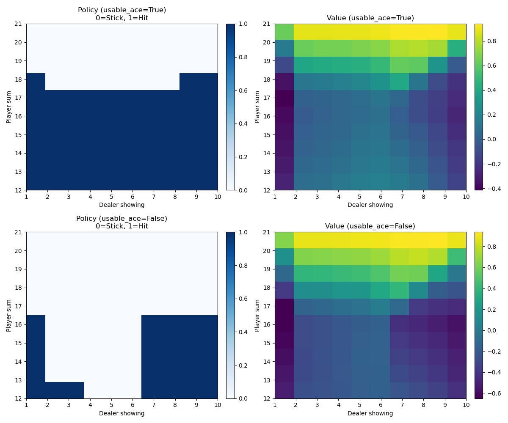

# RL_Projects
Practice RL concepts and try to reproduction some key concepts

## 1 - Solving Blackjack - Monte Carlo ES

1. This experiment implements an abstract Blackjack environment with Monte Carlo ES plus ε-greedy, demonstrating how to learn an optimal policy and value function without any hard-coded rules.  
2. By randomly initializing (state, action) and then following ε-greedy decisions, we thoroughly explore the space and converge to a stable strategy akin to the canonical solution in the literature.  
3. The final 2×2 visualization (policy and value for usable/non-usable ace) closely matches the step-like boundaries described in Sutton & Barto’s Example 5.3.

